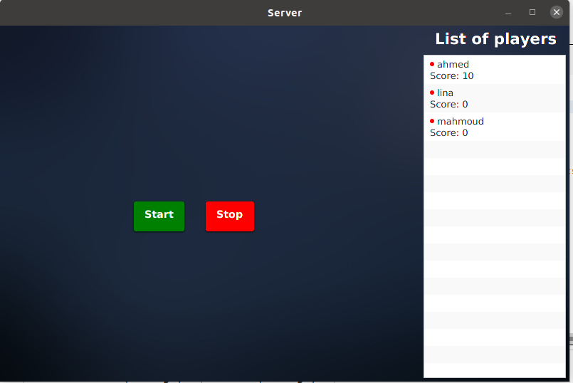
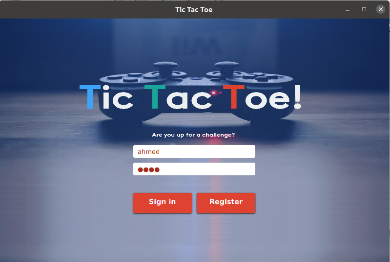
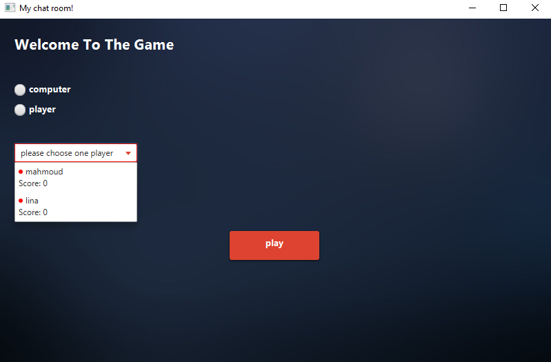
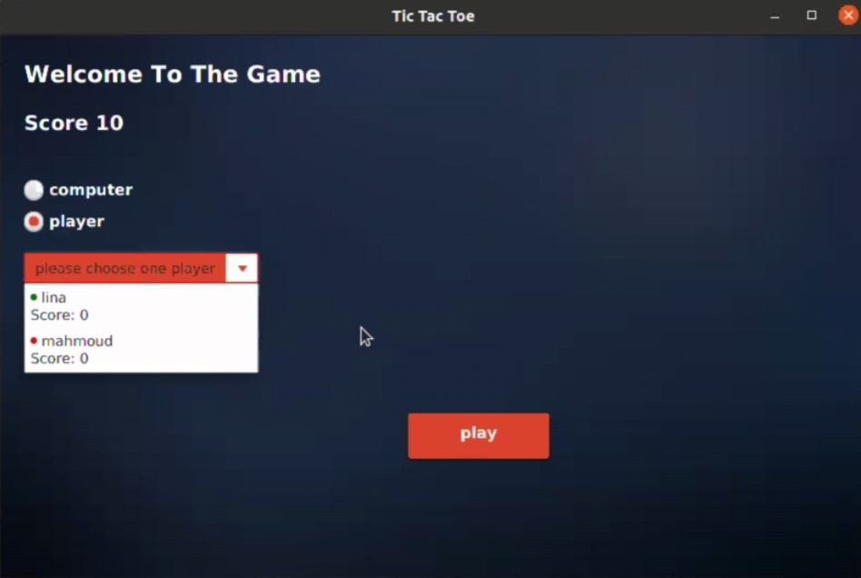
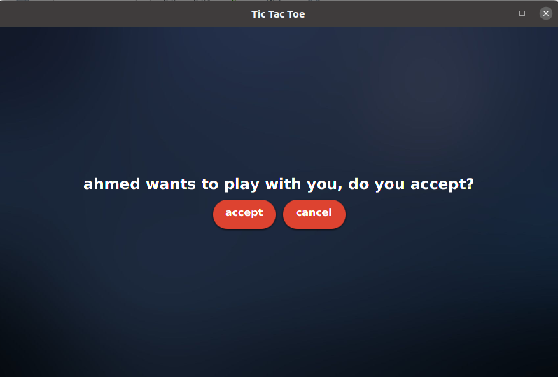
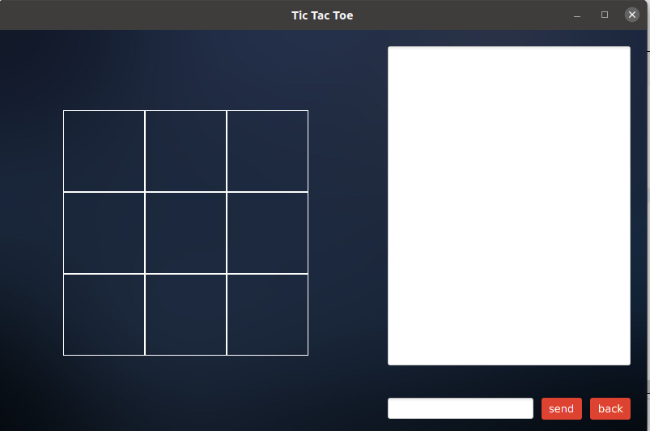
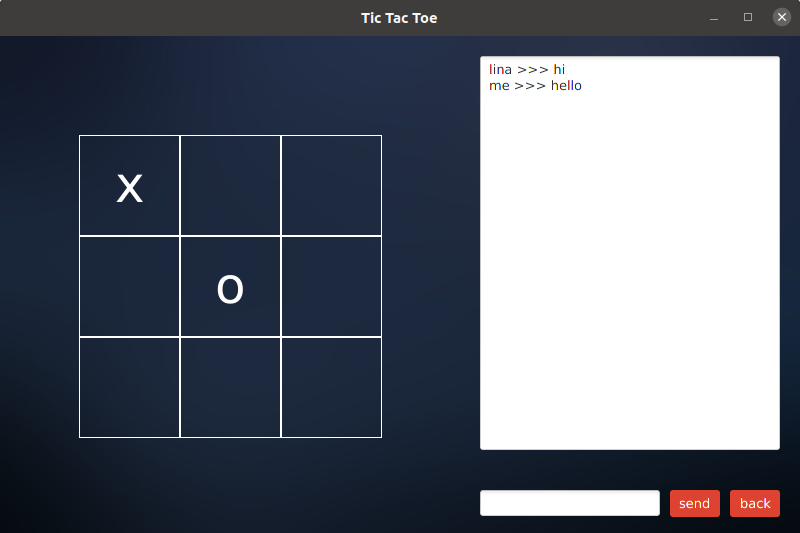

#This is TIC Tac Toe Project
## Installation
you have to create folder inside this folder you have to create two JAVAFX projects with names TicTacToe , SocketServerChat 
Then using your terminal write these commands 

```bash
git clone git@github.com:AhmedAtef3/Tic-Tac-Toe.git  
or if you forked this project to your own repo run git clone  YourRepoName
```
 Then you can open client and server projects using editor like netbeans or intellij 

 you have to add jar files to projects to be able to run it in client project ( Tic-Tac-Toe ) you have to add gson jar lib 
 in SocketServerChat project download gson liberary and jar files to you jdbc only 
 Don't care about the database it will be on your database , You only have to edit the DBTASK class in SocketServerChat and put your own connection parameters then the datase will installed 
 to your pc 
 Then enjoy with our lovely application 

first we have to run the server application 
it will display to us the list of all players in our system and the  open , close buttons to open the server or close it 
 So we have to open the server for let the players able to play our game 

 


 If our player has account like mahmoud or nada he/she will be able to login other wise he/she will register to our game.
  the first player entered our game using login 
 

 but there is no online player to play with
  

 another player registered to our system 
 

 the two players now are online to each other 
 one can request the other one to play with 
 the other one can accept or reject the request 
 

 if he accepted the request they will enter the room  
 
 (which they can play or chat together in )
 

## Contributors

+ Hatem Hashem
+ Ahmed Atef
+ Mahmoud Atef
+ Leena Sherif
+ Hossam Mohamed
+ Mai Maher
